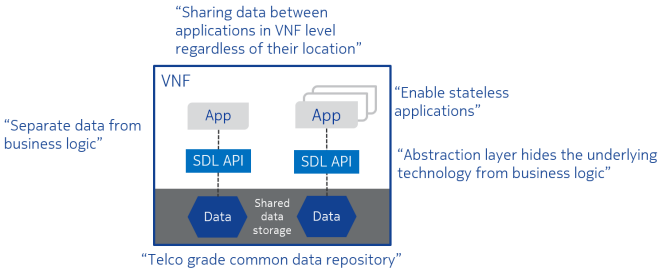
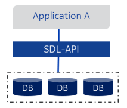
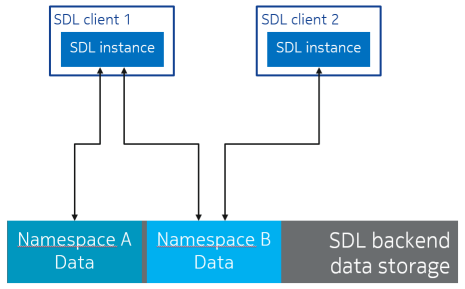

..
..  Copyright (c) 2019 AT&T Intellectual Property.
..  Copyright (c) 2019-2022 Nokia.
..
..  Licensed under the Creative Commons Attribution 4.0 International
..  Public License (the "License"); you may not use this file except
..  in compliance with the License. You may obtain a copy of the License at
..
..    https://creativecommons.org/licenses/by/4.0/
..
..  Unless required by applicable law or agreed to in writing, documentation
..  distributed under the License is distributed on an "AS IS" BASIS,
..  WITHOUT WARRANTIES OR CONDITIONS OF ANY KIND, either express or implied.
..
..  See the License for the specific language governing permissions and
..  limitations under the License.
..

##########
User Guide
##########

.. raw:: pdf

   PageBreak

.. contents::
   :depth: 3
   :local:

.. raw:: pdf

   PageBreak

Introduction
************

This is the user guide of O-RAN SC SDL C++ library.
Shared Data Layer (SDL) provides a lightweight, high-speed interface (API) for
accessing shared data storage. SDL can be used for storing and sharing any
data. Data can be shared at VNF level. One typical use case for SDL is sharing
the state data of stateful application processes. Thus enabling stateful
application processes to become stateless, conforming with, e.g., the
requirements of the fifth generation mobile networks.

Figure below illustrates some main points of SDL:

SDL has been implemented in many languages:

* C++ Linux shared library
* Golang package
* Python package

This document focuses on C++ implementation of SDL but general principles are
the same in all implementations.

.. raw:: pdf

   PageBreak

Key Concepts
************

**Backend Data Storage**

Backend data storage refers to data storage technology behind SDL API which
handles the actual data storing. SDL API hides the backend data storage
implementation from SDL API clients, and therefore backend data storage
technology can be changed without affecting SDL API clients. Currently, Redis
database is the most commonly used backend data storage implementation.

Figure below illustrates how SDL API hides backend data storage technology
from application:

`SDL Deployment section <#sdl-deployment>`_ provides further information
about backend data storage deployment options.

**Namespace**

Namespaces provide data isolation within SDL data storage. That is, data in
certain namespace is isolated from the data in other namespaces. Each SDL
client uses one or more namespaces.

Namespaces can be used, for example, to isolate data belonging to different
use cases.

Figure below shows an example of the SDL namespace concept. There are two SDL
clients, both accessing SDL backend data storage using an SDL API instance
(C++ object). Client 1 uses both namespaces: A and B, while client 2 uses only
namespace: B. Therefore, data in the namespace: A is visible only to client 1
and data in namespace: B is shared between clients 1 and 2:

Namespace management is planned to be moved under a managing entity which
enforces some control over how the namespaces are created. For now, however,
namespace naming needs to be manually coordinated between clients.

**Keys and Data**

Clients save key-data pairs. Data is passed as byte vectors. SDL stores the
data as it is. Any structure that this data may have (e.g. a serialized JSON)
is meaningful only to the client itself. Clients are responsible for managing
the keys. As namespaces provide data isolation, keys in different namespaces
always access different data.

.. raw:: pdf

   PageBreak

APIs
****

SDL provides currently following APIs:

* Asynchronous API for accessing SDL storage *shareddatalayer::AsyncStorage*
* Synchronous API for accessing SDL storage shareddatalayer::SyncStorage

Same SDL client can use one or more SDL APIs. There should rarely be need to
create several instances of the same SDL API though. All individual operations
done using SDL API functions are targeted to one namespace (accessing several
namespaces requires multiple operations).

SDL API functions are not thread-safe, meaning that same SDL instance must
not be shared between multiple threads without explicit locking in SDL client.

SDL API functions are atomic unless otherwise indicated. Indication of the
non-atomic behavior of certain function can be found from one or many of the
following:

* Function name
* Function parameters
* Function doxygen documentation (see below)

Refer to doxygen generated SDL API documentation below for further information
about SDL APIs and the functions they contain.

Doxygen Generated SDL API Documentation
=======================================

Pre-built online version of SDL API Doxygen documentation is not yet available.

Doxygen documentation can be generated manually. Follow instructions found from
:ref:`SDL developer guide <building_sdl_api_doc>`.

.. raw:: pdf

   PageBreak

Building Clients Using SDL
**************************

SDL API functions can be used by including SDL public headers and by linking
SDL shared library.

The necessary compilation and linker flags can be acquired with the
*pkg-config* tool::

    pkg-config --cflags libsdl
    pkg-config --libs libsdl

SDL internal implementation uses C++14, thus SDL clients need to be build
using a C++ compiler supporting C++14. However, SDL public API header files
contain only features which are available in C++11, thus SDL clients do not
need to be implemented (and compiled) using C++14 (C++11 is enough). The
compiler just needs to have support for C++14.

.. raw:: pdf

   PageBreak

Using SDL in Application Pod
****************************

SDL binary artifacts including Debian (.deb) and RPM Package Manager (.rpm)
packages are available in O-RAN-SC PackageCloud.io repository.

In runtime environment SDL needs also a database backend service, currently
SDL supports only Redis database. Recommended solution is to use DBaaS
component of the official RIC platform deployment.

**Deploying SDL database backend with DBaaS service in the RIC**

Download RIC deployment artifacts::

    git clone "https://gerrit.o-ran-sc.org/r/it/dep"

The **ric-platform** directory contains Helm chart and scripts to deploy RIC
platform components, including also DBaaS component.

RIC DBaaS service must be running before starting application pod which is
using SDL API. DBaaS defines environment variables which are used to contact
DBaaS service (offering backend for SDL). Those environment variables are
exposed inside application container only if DBaaS service is running when
application container is started. Refer to
`Database Backend Configuration section <#database-backend-configuration>`_,
for information about available environment variables.
You may test SDL connectivity to its backend with the *sdltool* command inside
your application container::

    sdltool test-connectivity

*sdltool* comes in SDL binary artifacts which are available in O-RAN-SC
PackageCloud.io repository.

For more information, see also `README <https://gerrit.o-ran-sc.org/r/gitweb?p=ric-plt/dbaas.git;a=blob;f=README.md;h=6391fc45ea762a5b606dcf9f867fac8087b1222f;hb=HEAD>`_
file of the *dbaas* O-RAN-SC gerrit repository.

.. raw:: pdf

   PageBreak

Configuration
*************

Certain aspects in SDL functionality can be configured by using environment
variables.

Database Backend Configuration
==============================

Database backend configuration can be used to configure, to which database
backend SDL instance connects. A list of available environment variables to
configure database backend:

* DBAAS_SERVICE_HOST
* DBAAS_SERVICE_PORT
* DBAAS_SERVICE_SENTINEL_PORT
* DBAAS_MASTER_NAME
* DBAAS_NODE_COUNT
* DBAAS_CLUSTER_ADDR_LIST

After DBaaS service is installed, environment variables are exposed to
application containers. SDL library will automatically use these environment
variables. If DBaaS service is not used, above environment variables needs to
be set manually so that SDL backend can connect to correct database.

When multiple Database (DB) service is used Nokia SEP deployments can have
comma separated list of DB ports, sentinel master group names and DB service
addresses:

 DBAAS_CLUSTER_ADDR_LIST=<comma separated list of DB services>
 DBAAS_MASTER_NAME=<comma separated list of DB sentinel master names>
 DBAAS_SERVICE_PORT=<comma separated list of DB service ports>
 DBAAS_SERVICE_SENTINEL_PORT=<comma separated list of Redis Sentinel ports>

In RIC platform deployments above list type of environment variables will have
a single value, because only one Database (DB) service is supported in RIC.

**Examples**

An example how environment variables can be set in bash shell, when standalone
Redis server is running in a Kubernetes Pod with k8s service name of *dbaas* and
port *6379*::

   export DBAAS_SERVICE_HOST=dbaas
   export DBAAS_SERVICE_PORT=6379
   export DBAAS_NODE_COUNT=1

Besides hostname, IPv4 and IPv6 addresses can be set to *DBAAS_SERVICE_HOST*.

An example how environment variables can be set in bash shell, when Redis
HA deployment is used::

   export DBAAS_MASTER_NAME=my-primary-sentinel
   export DBAAS_SERVICE_HOST=dbaas
   export DBAAS_SERVICE_SENTINEL_PORT=23550
   export DBAAS_NODE_COUNT=3

An example how environment variables can be set in bash shell, when Redis
HA deployment with two DB service is used::

   export DBAAS_CLUSTER_ADDR_LIST=dbaas-0,dbaas-1
   export DBAAS_MASTER_NAME=my-dbaasmaster-0,my-dbaasmaster-1
   export DBAAS_SERVICE_HOST=dbaas-0
   export DBAAS_SERVICE_PORT=6379,6380
   export DBAAS_SERVICE_SENTINEL_PORT=26379,26380
   export DBAAS_NODE_COUNT=3

.. raw:: pdf

   PageBreak

Errors
******

`Doxygen generated SDL API documentation <#doxygen-generated-sdl-api-documentation>`_
describes which error codes are returned and which exceptions are thrown from
each SDL API function. Generally, asynchronous SDL APIs return error codes and
synchronous SDL APIs throw exceptions in error situations.

Handling Error Codes Returned From Asynchronous SDL APIs
========================================================

Asynchronous SDL APIs return *std::error_code* based error codes in error
situations. Typically, error code is returned as a parameter in the related
callback function.

Returned error code contains detailed information about the error which has
occurred. This information is valuable for SDL developers in case the issue
needs further investigation, but usually this information is too detailed for
SDL client error handling logic. For SDL client error handling purposes SDL
provides *shareddatalayer::error* constants and the returned *std::error_code*
can be compared against these constants.

Therefore SDL clients are recommended to store the returned *std::error_code*
somewhere (for example to the log) and implement the error handling logic based
on *shareddatalayer::error* constants. C++ code example below illustrates this:

.. code-block:: c++

    if (error)
    {
        log.error() << "SDL operation failed, error: " << error
                    << " message: " << error.message() << std::endl;

        if (error == shareddatalayer::Error::NOT_CONNECTED)
            // Error handling logic for shareddatalayer::Error::NOT_CONNECTED
        else if (error == shareddatalayer::Error::OPERATION_INTERRUPTED)
            // Error handling logic for shareddatalayer::Error::OPERATION_INTERRUPTED
        else if (error == shareddatalayer::Error::BACKEND_FAILURE)
            // Error handling logic for shareddatalayer::Error::BACKEND_FAILURE
        else if (error == shareddatalayer::Error::REJECTED_BY_BACKEND)
            // Error handling logic for shareddatalayer::Error::REJECTED_BY_BACKEND
    }

*error* in the code block above is *std::error_code* type variable which is
returned from some asynchronous SDL API function. *log* is a logging service
what an SDL client is using. Note that this is a simple and incomplete example
for demonstration purposes and not meant to be used as such in real
environment. Complete error handling implementation depends on SDL client and
SDL API function which returned the error. For example, in some cases common
handling for several *shareddatalayer::error* constants might be sufficient.

**Instructions for Error Handling Logic Implementation**

Doxygen documentation contains detailed description for all
shareddatalayer::Error constants. This information helps to design error
handling logic for each shareddatalayer::Error constant. For example, following
information can be found from there:

* What has happened
* Is data modified in the backend data storage
* How to recover from error situation

Handling Exceptions Thrown by Synchronous SDL APIs
==================================================

Synchronous SDL APIs throw exceptions in error situations. There are
corresponding exceptions for all *shareddatalayer::error* constants returned
by asynchronous APIs (see previous section). All exceptions thrown by SDL are
derived from *shareddatalayer::Exception*.
Therefore, a client can catch *shareddatalayer::Exception* in case the client
wants to implement common handling for some SDL originated exceptions. Note
that external services, which SDL uses, can throw exceptions which are not
derived from *shareddatalayer::Exception*.

Below is a C++ code example of a scenario where SDL client does common error
handling for all exceptions thrown from synchronous SDL API:

.. code-block:: c++

    try
    {
        //Code which executes synchronous SDL API function
    }
    catch (const shareddatalayer::Exception& e)
    {
        log.error() << "SDL operation failed, error: " << e.what() << std::endl;
        //Common error handling logic for all SDL errors
    }
    //Catch also non-SDL exceptions (like std::exception) if needed

Below C++ code example has separate handling for shareddatalayer::BackendError
exception and common handling for all other exceptions thrown by SDL:

.. code-block:: c++

    try
    {
        //Code which executes synchronous SDL API function
    }
    catch (const shareddatalayer::BackendError& e)
    {
        log.error() << "SDL operation failed, error: " << e.what() << std::endl;
        //Error handling logic for BackendError
    }
    catch (const shareddatalayer::Exception& e)
    {
        log.error() << "SDL operation failed, error: " << e.what() << std::endl;
        //Common error handling logic for all other SDL errors than BackendError
    }
    //Catch also non-SDL exceptions (like std::exception) if needed

*log* is a logging service what an SDL client is using. Note that these are
simple and incomplete examples for demonstration purposes and they are not
meant to be used as such in real environment.

**Instructions for Error Handling Logic Implementation**

Doxygen documentation contains documentation for all exceptions thrown by SDL.
This documentation contains information which helps to design error handling
logic for each exception. For exceptions having corresponding error code,
exception documentation is usually a reference to corresponding error code
documentation.

Each SDL API function, which throws exceptions, has a link to the documentation
of those exceptions. This link can be found from the Doxygen documentation of
given SDL API function.

.. raw:: pdf

   PageBreak

SDL Properties
**************

This chapter discusses how certain general data storage related aspects work in
SDL. Discussed subjects include, for example, concurrency control and data
persistency.

SDL Deployment
==============

Production environments are typically deployed so that SDL backend data storage
and SDL clients are in different nodes (e.g. VM, container).

There are two different supported deployment modes for SDL backend data
storage:

* Standalone (single DB node without redundancy)
* Redundant (DB node pair working in primary/replica redundancy model)

SDL supports also Redis sentinel based DB cluster where deployment has one or
more DBAAS Redis sentinel group. Different DBAAS Redis sentinel groups
can be used to distribute SDL DB operations to different SDL DB instances. When
more than one DBAAS Redis sentinel group exits the selection of SDL DB instance
is based on the namespace string hash calculation.

SDL does not prevent backend data storage to be deployed in the same node with
the SDL client. Such deployments are, however, typically used only in
development/testing type of environments.

Concurrency Control
===================

SDL does not support transactions doing one or more units of work in ACID
manner (pessimistic concurrency control).

SDL supports optimistic concurrency control by providing Check and Set (CAS)
type conditional functions. These conditional functions provide possibility
to do certain data modification operations only if data value matches the SDL
client's last known value. Thus a SDL client can check that someone else has
not changed the data after it was read by the SDL client. If the data would
have been changed, SDL does not do the modification operation and this is
indicated to the SDL client. The SDL client can then decide how to handle the
situation (for example read the latest data and retry modification).

*AsyncStorage::setIfAsync* is an example of a conditional function discussed
above. Other conditional functions exist as well.

Data Persistency
================

Currently all data stored to SDL is stored to in-memory backend data storage.
Meaning that, data is not preserved over DB node restart. DB node restart does
not necessarily cause data loss for SDL client though. Refer to
`SDL Deployment section <#sdl-deployment>`_, for information about SDL backend
data storage redundancy models.

.. raw:: pdf

   PageBreak

Best Practices
**************

This chapter gives recommendations on how to use SDL.

Building Clients Using SDL
==========================

* Use *pkg-config* tool to acquire needed compilation and linking flags,
  instead of hardcoding them. This ensures that flags are always up-to-date.
  See more information from `here <#building-clients-using-sdl>`_.
* If you want to mock SDL APIs in unit testing, SDL provides helper classes
  for that. By using these helper classes you need to implement mock
  implementation only for those SDL API functions which you use in the unit
  tests. See more information from `doxygen documentation <#doxygen-generated-sdl-api-documentation>`_
  of the helper classes:

  * *include/sdl/tst/mockableasyncstorage.hpp: MockableAsyncStorage*
  * *include/sdl/tst/mockablesyncstorage.hpp: MockableSyncStorage*

Using SDL APIs
==============

* SDL APIs are not thread-safe. If same SDL API instance is shared between
  multiple threads, SDL client has to use explicit locking to ensure that only
  one thread at time executes SDL API functions.
* Each SDL instance establishes own connection to backend data storage, which
  requires resources (how heavy this exactly is depends on used backend data
  storage type). Thus, from performance point of view, only one SDL instance
  per one SDL API should be used if reasonably possible. One SDL instance can
  access multiple SDL namespaces when using *AsyncStorage* and *SyncStorage*
  APIs.
* Use waitReadyAsync() function before doing first operation via asynchronous
  APIs to ensure that SDL and backend data storage are ready to handle
  operations. See waitReadyAsync() function
  `doxygen documentation <#doxygen-generated-sdl-api-documentation>`_
  for corresponding asynchronous API for details.
* Use waitReady() function before doing first operation via synchronous
  APIs to ensure that SDL and backend data storage are ready to handle
  operations. See waitReady() function
  `doxygen documentation <#doxygen-generated-sdl-api-documentation>`_
  for corresponding synchronous API for details.
* Avoid using heavy search functions (for example: *AsyncStorage::findKeys()*).
  Rather define your keys so that you know which keys should be read.

Using SDL Namespaces
====================

* As namespace naming is currently on SDL client's responsibility, use enough
  specific namespace names that same name is surely not used by someone else
  (unless you want to share given namespace data with that someone else).
* Data entities related to each other should be placed under the same
  namespace (unless there is a good reason not to). For example, accessing
  multiple data entities with one SDL operation is possible only for data
  entities belonging to same namespace.
* Identically named keys can be used in different namespaces. Creating own
  namespaces for different use cases and unrelated data provides more freedom
  into key name selection.

Data Management
===============

* Writing or reading one big junk of data at once is more efficient than
  writing/reading the same amount of data in small steps. For example, create a
  key list and read it once, rather than reading each key in a loop.
* If rolling upgrade needs to be supported, consider using Google Protocol
  Buffers (or something similar) to make it possible to parse data which is
  written by older or newer application version.

.. raw:: pdf

   PageBreak

SDLCLI
******

There is a pre-installed *sdlcli* tool in DBaaS container. With this tool user
can see statistics of database backend (Redis), check healthiness of DBaaS
database backend, list database keys and get and set values into database.
For example to see statistics give below command inside DBaaS container::

    sdlcli statistics

To check healthiness of database::

    sdlcli healthcheck

Use *sdlcli* help to get more information about available commands::

    sdlcli --help
